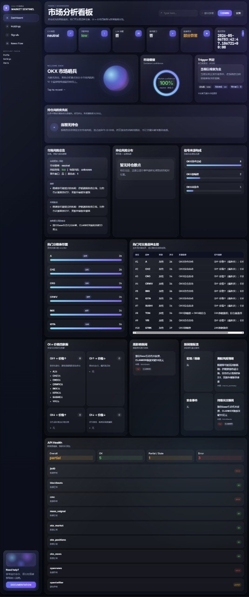
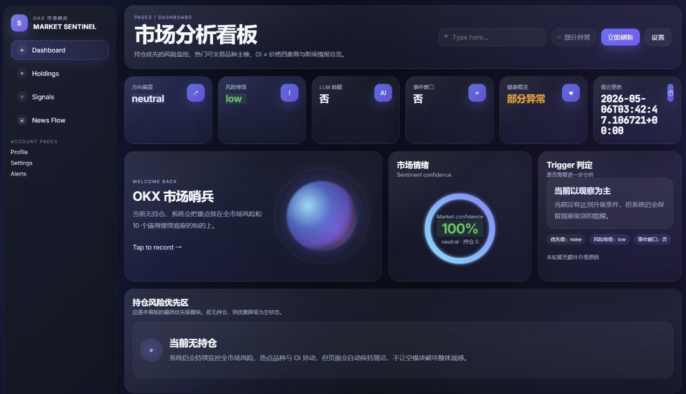

[English](README.md) | [中文](README.zh.md)

# OKX Market Sentinel Skill

## Overview

This is an unofficial Python market sentinel example for OKX market monitoring and Agent Skill workflows. It is intended for agent systems such as OpenClaw and Hermes that support AgentSkills-style skill directories.

This project is meant to provide a reference approach for building a crypto market monitoring system. The system can periodically collect OKX market data, OKX news, account and positions data, macro market data, crypto news, social heat, and semantic risk phrases, then aggregate them into a unified market context cache and trigger candidates. On top of that, users can build custom monitoring logic, risk rules, notification strategies, dashboard views, or use the project as an external skill for OpenClaw / Hermes.

This project does not directly provide automated trading, order execution, profitable strategies, investment advice, or any return guarantee. It is strongly recommended to use it only for research, simulated monitoring, or read-only API environments. If you connect a real OKX account, use read-only API keys only and do not grant trading permissions.

This project is not related to official OKX Trading Bot features. If you want official OKX products such as Grid, DCA, or arbitrage bots, please refer to OKX's official Trading Bot offerings.

---

## What the output actually looks like

If you are not here to read architecture first and just want to know what this project actually sends to a user, start with a realistic notifier-style example.

```text
OKX Market Sentinel | Scan complete
• Status: healthy
• Priority holdings: BTC, ETH
• Market bias: bearish
• Risk level: high
• Escalate to deeper analysis: yes
• Watch-only triggers: macro event window, holdings pressure

Risk trigger summary
Macro risk confluence     : triggered
Holdings security issue   : none
Holdings event cluster    : triggered
Escalate to deeper review : yes
Watch-only triggers       : macro event window, holdings pressure

Symbols worth watching
• Current shortlist: BTC, ETH, SOL, DOGE
• From existing holdings: BTC, ETH
• From social momentum: SOL, DOGE
• From OKX OI changes: ETH, SOL

Holdings at risk
1. BTC | risk=high | events=2 | heat=18 | drivers=macro event window, holdings event cluster
2. ETH | risk=medium | events=1 | heat=11 | drivers=open-interest change

Top tradeable symbols
1. SOL | score=82 | source=social momentum + OKX OI changes | why=high social heat; leading open-interest move
2. DOGE | score=71 | source=social momentum | why=multi-account consensus
```

In plain English, that is the product:

- it keeps scanning the market in the background
- it checks your current holdings first
- it surfaces the tradeable symbols worth watching next
- it packages the result into a Telegram / agent-friendly message

## Dashboard Preview

If you would rather see what the finished product looks like before reading the code, start with these two screenshots:





## Getting Started

### Prerequisites

Python version: >= 3.10  
It is recommended to run this project inside a Python virtual environment.

## Dependencies

Core dependencies:

- `python` >= 3.10
- `requests`
- `PyYAML`
- `pytest`
- `ruff`

Optional dependencies:

- OKX API keys with read-only permission
- `okx` CLI if your local workflow depends on OKX-related command-line integrations
- `hermes` CLI for automatic Semantic Compass refresh
- OpenClaw for skill loading and agent integration
- Telegram Bot Token for risk notifications

If the repository already includes a `requirements.txt`, use it first:

```bash
pip install -r requirements.txt
```

If a complete dependency file is not available in the current version, you can start with the minimum runtime dependencies:

```bash
pip install requests PyYAML pytest
```

---

## Quick Start

If you only want the shortest install path, start with this Hermes one-liner:

```bash
mkdir -p ~/.hermes/skills/market-monitoring && cp -r skills/crypto-market-sentinel ~/.hermes/skills/market-monitoring/
```

If you want more than the skill package — for example the dashboard, pipeline, notifier, and tests — continue with the full local setup below.

Create and activate a Python virtual environment.

macOS / Linux:

```bash
python3 -m venv .venv
source .venv/bin/activate
```

Windows:

```bash
python -m venv .venv
.venv\Scripts\activate
```

Install dependencies.

```bash
pip install -U pip
pip install -r requirements.txt
```

If the current version does not yet provide `requirements.txt`, you can install the basic dependencies first:

```bash
pip install requests PyYAML pytest
```

Check the configuration files. The main configuration paths are:

```text
config/phase3_rules.yaml
config/semantic_compass.json
skills/crypto-market-sentinel/templates/dashboard_settings.example.json
```

If you want to read OKX account or positions data, configure your OKX API credentials in local environment variables or a `.env` file. Read-only API keys are strongly recommended.

```bash
OKX_API_KEY=***
OKX_API_SECRET=***
OKX_PASSPHRASE=<your_passphrase>
OKX_IS_PAPER_TRADING=true
```

If you want Telegram notifications, configure:

```bash
TELEGRAM_BOT_TOKEN=<your_...ken>
TELEGRAM_CHAT_ID=<your_telegram_chat_id>
```

Run the main Market Sentinel pipeline.

```bash
python scripts/phase3_pipeline.py
```

This command runs source collection, context aggregation, and trigger generation in sequence, then writes the results into the local `context/` directory.

Start the local dashboard.

```bash
python dashboard/server.py --host 127.0.0.1 --port 8765
```

Then open the following URL in your browser:

```text
http://127.0.0.1:8765
```

If you want to receive notifications through Telegram, run:

```bash
python scripts/run_phase3_notifier.py
```

If you want Hermes to help refresh Semantic Compass, run:

```bash
python scripts/semantic_compass.py
```

Run tests:

```bash
pytest -q
```

---

## Monitoring Targets and Runtime Modes

By default, this project does not trade and does not place orders automatically. Its core purpose is market monitoring, risk detection, context aggregation, and agent trigger generation.

### Local Pipeline Mode

Local Pipeline Mode reads configuration files, fetches data from multiple sources, and generates unified market context files.

```bash
python scripts/phase3_pipeline.py
```

Main outputs:

```text
context/context_cache.json
context/trigger_candidates.json
reports/
```

### Dashboard Mode

Dashboard Mode starts a local HTTP service for displaying market state, risk summaries, trigger candidates, and configuration status.

```bash
python dashboard/server.py --host 127.0.0.1 --port 8765
```

Binding only to `127.0.0.1` is recommended by default. If you need to expose it to a LAN or the public internet, add your own authentication, reverse proxy, and access controls.

### Telegram Notifier Mode

Notifier Mode runs the Market Sentinel pipeline and sends Telegram messages when important changes are detected.

```bash
python scripts/run_phase3_notifier.py
```

This mode is suitable for scheduled tasks, cron jobs, or lightweight long-running monitoring environments.

### Agent Skill Mode

This project includes:

```text
skills/crypto-market-sentinel/SKILL.md
skills/crypto-market-sentinel/references/
skills/crypto-market-sentinel/templates/
```

These files can be used as a skill directory for agent systems such as OpenClaw or Hermes. An agent can read `SKILL.md` and use the companion references to understand how to run Market Sentinel, inspect the dashboard, read the context cache, or interpret trigger candidates.

Example Hermes install path:

```bash
mkdir -p ~/.hermes/skills/market-monitoring
cp -r skills/crypto-market-sentinel ~/.hermes/skills/market-monitoring/
```

For OpenClaw users, see:

```text
OPENCLAW_SETUP.md
```

For Hermes users, see:

```text
HERMES_SETUP.md
```

### Semantic Compass Mode

Semantic Compass is used to maintain the semantic risk phrase pack, including geopolitical risk, exchange risk, regulatory risk, major news risk, and cooldown phrases.

Configuration file:

```text
config/semantic_compass.json
```

Run a refresh:

```bash
python scripts/semantic_compass.py
```

This mode is useful when you want an agent to continuously adjust the risk phrase set based on current market language and news context.

---

## Compatibility

This repository is mainly intended for the following usage patterns:

- **Hermes**: use it directly as a local skill plus a runnable reference implementation
- **OpenClaw**: use it as a skill directory and integrate it according to the repository documentation
- **Other agent runtimes**: adapt the repository structure, scripts, and configuration to your own environment

It is not an official plugin for one specific runtime. It is a reusable and modifiable market monitoring skill repository.

---

## Configuration Notes

### phase3_rules.yaml

`config/phase3_rules.yaml` stores the main Market Sentinel rules, including:

- data staleness windows
- event windows
- risk keywords
- news risk thresholds
- social heat thresholds
- market context thresholds
- trigger generation rules

Users can modify these parameters based on their own instruments, risk preferences, and monitoring goals.

### semantic_compass.json

`config/semantic_compass.json` stores the semantic risk phrase pack, including:

- `geo_risk`
- `news_risk`
- `regulatory_risk`
- `exchange_risk`
- cooldown phrases
- severity anchors

This file helps the system recognize risk semantics in headlines and text, rather than relying only on fixed keywords.

### dashboard_settings.example.json

The Dashboard settings template is located at:

```text
skills/crypto-market-sentinel/templates/dashboard_settings.example.json
```

It is recommended to copy it into a local settings file before editing, rather than modifying the template directly.

---

## Output

After running the main pipeline, the terminal may print output like this:

```text
RUN SOURCE okx_market_fetch ... OK
RUN SOURCE okx_news_fetch ... OK
RUN SOURCE okx_positions_fetch ... OK
RUN SOURCE macro_fetch ... OK
RUN SOURCE crypto_news_fetch ... OK
RUN SOURCE social_heat_fetch ... OK

BUILD CONTEXT CACHE
context/context_cache.json written

BUILD TRIGGER CANDIDATES
context/trigger_candidates.json written

==== Market Sentinel Summary ====
Time: 2026-05-05 14:37:21
Mode: local pipeline
Primary Exchange: OKX
Market State: neutral
Macro Risk: medium
Crypto News Risk: medium
Geo Risk: low
Social Heat: elevated

Watched Instruments:
- BTC-USDT-SWAP
- ETH-USDT-SWAP
- SOL-USDT-SWAP

Hot Symbols:
1. BTC
2. ETH
3. SOL
4. DOGE
5. XRP

Wake Triggers: 2
Observe Only Triggers: 5
Context Cache: context/context_cache.json
Trigger Candidates: context/trigger_candidates.json
==== End of Summary ====

WAKE BTC-USDT-SWAP
Reason: market volatility increased while related news risk is medium

OBSERVE_ONLY ETH-USDT-SWAP
Reason: price movement is notable but risk score is below wake threshold
```

After starting the dashboard, the terminal may show:

```text
Serving dashboard at http://127.0.0.1:8765
GET /api/dashboard
GET /api/context
GET /api/triggers
```

After running the Telegram notifier, the terminal may show:

```text
RUNNING PHASE3 PIPELINE
LOADING PREVIOUS SNAPSHOT
BUILDING CHANGE SUMMARY
SENDING TELEGRAM MESSAGE
NOTIFIER DONE
```

---

## Project Structure

```text
okx-market-sentinel-skill/
├── config/
│   ├── phase3_rules.yaml
│   └── semantic_compass.json
├── dashboard/
│   ├── server.py
│   └── dashboard_adapter.py
├── docs/
├── scripts/
│   ├── phase3_pipeline.py
│   ├── build_context_cache.py
│   ├── build_triggers.py
│   ├── run_phase3_notifier.py
│   ├── semantic_compass.py
│   └── sources/
├── skills/
│   └── crypto-market-sentinel/
│       ├── SKILL.md
│       ├── references/
│       └── templates/
├── tests/
├── HERMES_SETUP.md
├── OPENCLAW_SETUP.md
├── README.md
└── README.zh.md
```

---

## Security Notes

Do not commit the following to GitHub:

```text
.env
OKX API keys
Telegram Bot Token
context/
reports/
local cache files
account and positions files
```

Recommendations:

- enable read-only permission for OKX API keys
- do not grant trading permission to this project
- do not expose the dashboard directly to the public internet
- if exposure is required, add authentication and a reverse proxy
- do not put real account screenshots, positions, or API credentials into issues or commits
- periodically review `.gitignore` and `.clawhubignore`

For more security information, see `SECURITY.md`.

---

## Testing

Run the full test suite:

```bash
pytest -q
```

Run a single test file:

```bash
pytest tests/test_phase3_pipeline.py -q
pytest tests/test_dashboard_server.py -q
pytest tests/test_semantic_compass.py -q
```

Before committing changes, it is recommended to run:

```bash
pytest -q
ruff check .
```

---

## Use Cases

This project is suitable for:

- building a crypto market risk monitoring system
- providing a market monitoring skill for OpenClaw / Hermes
- aggregating OKX market data with external news sources
- generating a context cache that agents can read
- generating `wake` / `observe_only` trigger types
- building Telegram risk alerts
- building a local dashboard
- researching how agents can participate in pre-trade information gathering and risk judgement

This project is not suitable for:

- direct automated order execution
- high-frequency trading
- market-making execution
- custody of funds
- unsupervised real-account trading
- any system that promises profits

---

## Disclaimer

This is an unofficial project and has no direct relationship with OKX.

This project is provided for demonstration, research, and agent skill workflow development only. It does not constitute investment advice, trading advice, or a financial service. It does not guarantee data completeness, timeliness, or accuracy, and it does not guarantee any trading return.

Users are responsible for evaluating market risk, API permission risk, system failure risk, and information delay risk on their own. Any trading, investment, or account operation based on this project is entirely the user's own responsibility.

---

## License

This repository is released under the MIT License. See `LICENSE` for details.
